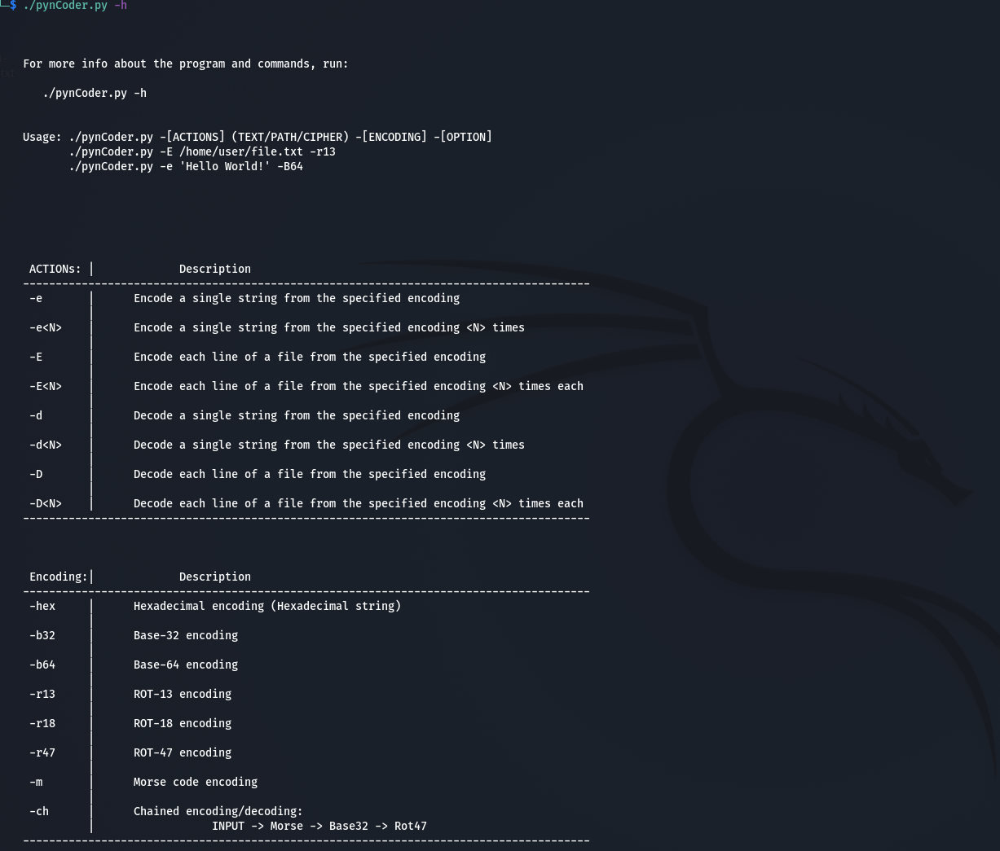
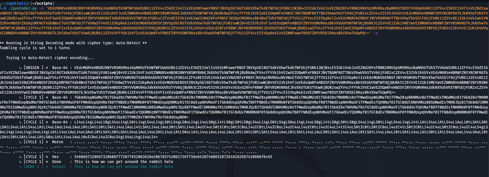
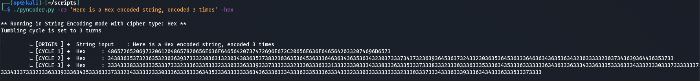
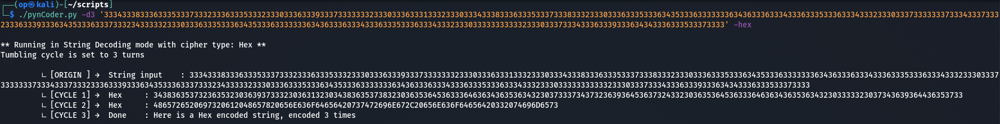

# pynCoder

## Contribution

Contributions are welcome, just send me an email and we will work something out together!

## Description

`pynCoder` is a CLI tool that allows you to encode/decode strings or files through the command line.  
I made this tool in order to simplify the process of decoding various messages or flags that can be found in some CTF challenges.  
We all know that CTF creators tends to be evil sometimes by encoding messages with multiple algorithm on top of each other, 
Making the process a bit tedious in the long run.  

---

## Usage

- Get Help:  
  &emsp;`./pynCoder.py -h`  
- Encode a String in Base64 :  
  &emsp;`./pynCoder.py -e "Hello World!" -b64`  
- Decode a String from Base64 :  
  &emsp;`./pynCoder.py -d "SGVsbG8gV29ybGQh" -b64`  
- Encode a String in Base64 4 times :  
  &emsp;`./pynCoder.py -e4 "Hello World!" -b64`  
- Decode a String from Base64 4 times :  
  &emsp;`./pynCoder.py -d4 "VlRCa1YyTXlTa2hQUjJSWFRXcHNOVmxyWkZKaFFUMDk=" -b64`  
- Decode a String by Auto-Detection :  
  &emsp;`./pynCoder.py -d 'u*)rc{#pu*"rc{y~u*"rc{y~u*"ra{y}tp)$p{#}u&"ra{y}tp)ra{#pu*($c{#pu&)rcxq}u*($c{y}' -a`  
- Encode a File in Rot-47 :  
  &emsp;`./pynCoder.py -E README.md -r47`  
- Decode a File from Rot-47 :  
  &emsp;`./pynCoder.py -D README.md -r47`  

---

## Functionalities

There's an 'Auto-Detect' feature implemented (which is still experimental, so it might still be prone to errors), that allows to decode a strings in cycles. 
The Auto-Detect feature is only working in `String Decoding mode` for now and will be implemented in `File Decoding mode` eventually  
Example :  If we supply a Base64 string which was encoded 5 times in a row, then the Auto-Detect feature  
will keep decoding the string until it reaches the string's original form (considering that the original string was written in normal plain text)  
It can also detect some chained encoding like : Plain Text -> Hex -> Morse -> Base64 -> Base64 -> Base64 

---

## Supported Encodings

`pynCoder` supports the following encodings as for now :

- Morse
- Hex (Base16)
- Base32
- Base64
- Rot13
- Rot18
- Rot47

### Note: pynCoder cannot Auto-Detect any of the Rotary algorithm (Rot13, Rot18, Rot47) for the moment.

---

## Examples

### Get Help

   

### Auto-Detect feature applied in String Decoding mode

   

### Hex encoding over 3 iterations

  

### Hex decoding over 3 iterations

  
